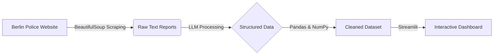

# Finding Conan: Berlin Safety Dashboard 🕵️‍♂️🇩🇪

[](https://streamlit.io)
[](https://www.python.org/)
[](https://opensource.org/licenses/MIT)

## 🎯 Project Mission
> **"In order to help Berliners go home safely, I collected and visualized the criminal cases in Berlin and created a dashboard to showcase the distribution of certain types of crime on the map of Berlin."**

**Finding Conan** is a data-driven initiative acting as a digital detective. By analyzing official police reports, this project aims to provide transparency regarding public safety in Berlin, answering social questions through rigorous data science.

## ⚙️ Architecture & Pipeline

This project transforms unstructured text into actionable geospatial insights through a three-step pipeline:



### 1. Data Collection

* **Source:** Automated scraping of *Polizeimeldungen* (Police Reports) directly from [Berlin.de](https://www.berlin.de/polizei/polizeimeldungen/).
* **Tooling:** Python (BeautifulSoup/Requests).

### 2. LLM Transformation

* **Engine:** Utilizes **Large Language Models (LLMs)** to parse complex narrative text.
* **Entity Extraction:** Automatically identifies and extracts:
* 📍 **Location** (Geocoded)
* ⏰ **Time & Date**
* ⚖️ **Crime Type & Severity**
* 👥 **Demographics** (Offender and Victim profiles)


### 3. Visualization

* **Interface:** Interactive **Streamlit** dashboard.
* **Insight:** Maps crime distribution across Berlin neighborhoods to identify patterns and hotspots.

## 🚀 Key Features

* **Interactive Map:** Geospatial visualization filtering crimes by district or neighborhood.
* **Demographic Insights:** Analysis of offender and victim demographics extracted from report descriptions.
* **Category Analysis:** Drill down into specific incident types (e.g., theft, assault, traffic accidents).
* **Time Series:** Temporal analysis to observe trends in crime frequency over days, weeks, or months.

## 🛠️ Tech Stack

* **Language:** Python
* **Web Framework:** Streamlit
* **Data Processing:** Pandas, NumPy
* **AI/ML:** LLMs (Entity Extraction/NLP)
* **Scraping:** BeautifulSoup

## 📂 Repository Structure

```text
finding-conan/
├── data/                  # Raw and processed datasets
├── frontend/
│   └── streamlit/
│       └── my-streamlit-time.py  # Main dashboard entry point
├── scrapers/              # Scripts for fetching police data
└── requirements.txt       # Project dependencies

```

## 💻 Getting Started

### Prerequisites

* Python 3.x
* API Keys for your LLM provider (if running the extraction pipeline from scratch).

### Installation

1. **Clone the repository:**
```bash
git clone [https://github.com/hclpush/finding-conan.git](https://github.com/hclpush/finding-conan.git)
cd finding-conan

```


2. **Install dependencies:**
```bash
pip install -r requirements.txt

```


3. **Run the Dashboard:**
```bash
streamlit run frontend/streamlit/my-streamlit-time.py

```


## 🤝 Contributing

Contributions are welcome! If you have ideas for better data visualization, improved scraping logic, or prompt engineering for the LLM:

1. Fork the project.
2. Create your feature branch (`git checkout -b feature/AmazingFeature`).
3. Commit your changes (`git commit -m 'Add some AmazingFeature'`).
4. Push to the branch (`git push origin feature/AmazingFeature`).
5. Open a Pull Request.

## ✍️ Author

**Hsin-Chih Lee (hclpush)**
*Data scientist utilizing machine learning to answer social questions and improve urban safety.*

---

*Disclaimer: This project is for informational purposes only and analyzes publicly available data. It is not an official service of the Berlin Police.*
